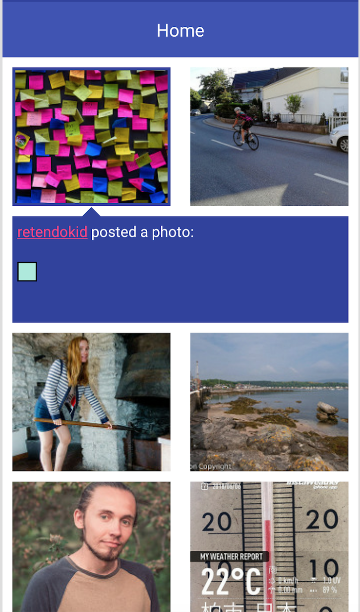
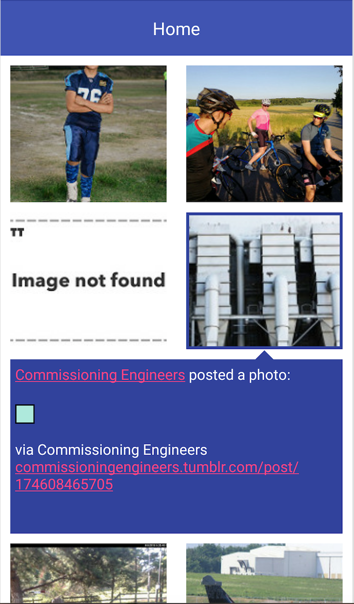

# FlickrSample
1. It displays flickr public feed images in recyclerview. 
2. Image item will expand/collapse on click of image item. 
3. Image item description will show on expanded view. 
4. Pull to refresh added to refresh feed data.

